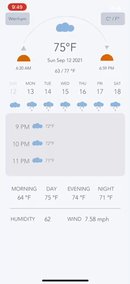

# Weatherly

## Have you ever been annoyed constantly having to switch between the calendar and weather app to plan an event? With the weather-based scheduler, you can have it all in one place. 

This app is for anyone who wants to plan events based on the weather. It has a week-based calendar where it shows you the weather summary for that day, including the current, low and high temperatures, sunrise and sunset times, and humidity and wind speed. Each day is divided into hours, and each hour is described by an weather icon and temperature during that time. The app automatically pulls data from the default calendar on the phone and adds it onto the app's calendar. 

***Because I'm using a free API, you can only get hourly weather data up to 48 hours. So, after 48 hours, the app doesn't show hourly data.***

## Try it out!
1. Install Expo Go from the device's App Store
2. Clone repository
3. run 'npm start'
4. Scan the QR code and run it on your phone

## This is an ongoing project. 
The following still has to be done:

1. Add events on the App that automatically gets added to the phone's calendar 
2. Change from Celcius to Fahrenheit and vice versa
3. Edit existing events

## Credits to:
- OpenWeather for the free weather data.
- Sion Hur for the amazing design.
